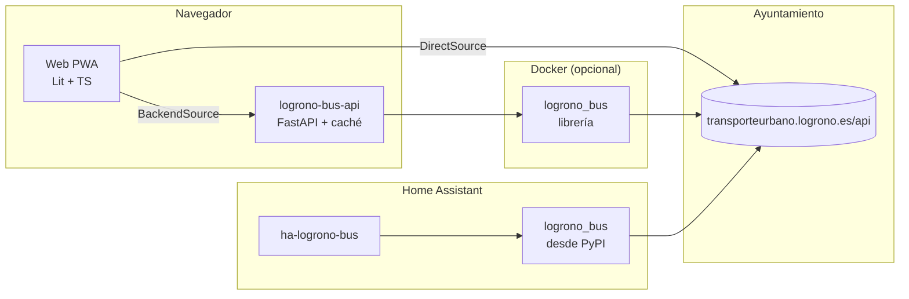

# Arquitectura

## Piezas

| Pieza | Dónde | Qué hace |
|---|---|---|
| Librería `logrono_bus` | `packages/logrono-bus` | Cliente asíncrono (aiohttp), modelo de dominio, normalización, deducción del sentido, tarjetas, formato de la selección `p`. Se publica en PyPI y la usan el servicio y Home Assistant. |
| Servicio `logrono_bus_api` | `services/api` | FastAPI: caché compartida con petición única, protección del origen (cubo de fichas + cortacircuitos), `/api/v1`, errores RFC 9457, logs JSON, métricas Prometheus, sirve la web. |
| `@logrono-bus/core` | `web/packages/core` | Gemelo TypeScript de la librería: normalización, sentido, tarjetas, URL del panel, fuentes de datos. Sin DOM. |
| `@logrono-bus/board` | `web/packages/board` | Componentes Lit `<logrono-bus-board>` y `<lb-card>`, bucle de refresco. Reutilizable (p. ej. como tarjeta Lovelace). |
| PWA | `web/apps/pwa` | Portada, asistente, panel, modo pantalla, ajustes, temas. |
| Tarjeta de HA | `web/packages/ha-card` | `custom:logrono-bus-card`: las mismas tarjetas, alimentadas con los sensores. Se compila a un solo JS (`just ha-card`) que la integración incluye y registra. |
| Integración HA | repo `chiva/ha-logrono-bus` | Coordinadores, sensores, subentradas por parada, reparaciones. |

## Decisiones clave

- **Sin base de datos:** el panel *es* su URL ([ADR 0004](../adr/0004-sin-base-de-datos.md)).
- **Híbrido:** la web funciona sola contra el Ayuntamiento; el servidor es opcional
  ([ADR 0001](../adr/0001-arquitectura-hibrida.md)).
- **Una lógica, dos lenguajes, un contrato:** Python y TypeScript se comprueban contra los mismos
  ficheros de referencia ([contrato de datos](contrato-datos.md)).
- **Proveedor intercambiable:** `TransitProvider` aísla el origen de datos, que puede cambiar con la
  nueva concesión de 2027 ([ADR 0002](../adr/0002-proveedor.md)).
- **Nunca adivinar el sentido** ([ADR 0005](../adr/0005-sentido.md)).

## ¿Por qué Python y TypeScript?

No es una preferencia: lo imponen los dos sitios donde se ejecuta el proyecto.

| Dónde se ejecuta | Lenguaje obligado | Piezas |
|---|---|---|
| Home Assistant | Python (instala dependencias desde PyPI) | librería `logrono_bus`, integración |
| Navegador (web, Echo Show, Portal, panel de HA) | JavaScript/TypeScript | `@logrono-bus/core`, `board`, PWA, tarjeta de HA |

Alternativas descartadas:

- **Solo Python**, con la web como interfaz sin lógica: la web dependería siempre de un servidor
  (público o tuyo). Se pierde la web estática que funciona sin instalar nada y todas las consultas
  saldrían de una sola IP hacia el Ayuntamiento.
- **Solo TypeScript**, sin integración de HA: se pierden los sensores y con ellos las
  automatizaciones, el historial y los widgets de Android de la app Companion.

El precio es mantener la normalización dos veces; el [contrato de datos](contrato-datos.md) lo
acota con ficheros de referencia comunes. El servidor (`services/api`) es la única pieza Python
prescindible: solo aporta caché común, salida en texto para widgets y una alternativa si el
Ayuntamiento retira CORS.

## Flujo de una actualización (modo directo)

1. `<logrono-bus-board>` arranca un `Poller` (30 s, espera exponencial con jitter en fallos, pausa
   si la pestaña está oculta).
2. Por cada parada distinta del panel, `DataSource.arrivals(stop)` pide **todas** sus líneas en una
   sola petición.
3. `normalizeArrivals` descarta llegadas ajenas o pasadas, deduce el sentido y ordena.
4. `buildCards` agrupa en tarjetas según la selección.
5. Entre refrescos, un tic cada 5 s recalcula los minutos con el reloj local.
