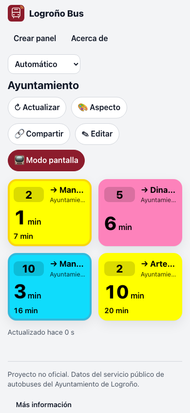

# Usarlo en el móvil

Logroño Bus es una web, pero se puede «instalar» en la pantalla de inicio para abrirla con un toque,
a pantalla completa, como cualquier aplicación. No ocupa casi nada y se actualiza sola.

{ width="300" }

## Android (Chrome)

1. Abre [chiva.github.io/logrono-bus](https://chiva.github.io/logrono-bus/) y [crea tu panel](03-crear-tu-panel.md).
2. Con tu panel abierto, toca el menú **⋮** (arriba a la derecha).
3. Toca **Añadir a pantalla de inicio** → **Instalar**.

**Cómo saber que ha funcionado:** aparece el icono rojo con un autobús en tu pantalla de inicio. Al
tocarlo se abre directamente tu panel, sin la barra del navegador.

## iPhone (Safari)

1. Abre tu panel en **Safari** (en otros navegadores de iPhone no aparece la opción).
2. Toca el botón **Compartir** (el cuadrado con una flecha hacia arriba).
3. Baja y toca **Añadir a pantalla de inicio** → **Añadir**.

## Ver las paradas que tengo cerca

En **Crear panel**, el botón **📍 Cerca de mí** busca las paradas a unos 600 metros. El navegador te
preguntará si das permiso para usar tu ubicación: hace falta para esto, y **tu ubicación no se envía
a nadie** (solo se usa para ordenar las paradas por distancia y marcarte en el mapa). Eso sí, si abres
el mapa, este descarga de OpenStreetMap las imágenes de la zona en la que estás.

!!! tip "¿Te sale un error de ubicación?"
    Mira [Si algo falla → La ubicación no funciona](11-problemas.md#la-ubicacion-no-funciona).
