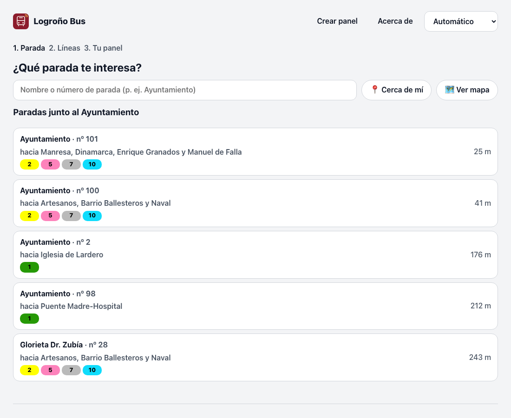

# Crear tu panel

Un **panel** es tu selección de paradas y líneas. Se crea en tres pasos y el resultado es **un
enlace**: guárdalo, compártelo o ábrelo en otra pantalla, y verás exactamente lo mismo.

## 1. Elige la parada

Entra en [chiva.github.io/logrono-bus](https://chiva.github.io/logrono-bus/) y toca **Crear mi panel**.

{ width="640" }

Tienes tres formas de encontrarla:

- **Escribe** el nombre o el número de la parada («ayuntamiento», «zubía», «101»). No importan las
  tildes ni las mayúsculas.
- **📍 Cerca de mí** usa tu ubicación.
- **🗺️ Ver mapa** muestra todas las paradas; toca la tuya. Al pasar por encima de una parada ves su
  nombre, su número y sus líneas. Si has pulsado **📍 Cerca de mí**, el mapa se centra donde estás y
  te marca con un punto azul.

!!! note "Dos paradas con el mismo nombre"
    Casi siempre hay una parada a cada lado de la calle con el mismo nombre (por ejemplo, las dos
    de **Ayuntamiento**, nº 101 y nº 100). Para distinguirlas, fíjate en la línea gris de debajo:
    **«hacia Manresa, Dinamarca…»** te dice hacia dónde van los autobuses que paran ahí.

## 2. Elige líneas y sentido

Verás una casilla por cada línea y sentido que pasa por esa parada, por ejemplo
**2 → Manresa**. Deja marcadas las que te interesen y toca **Añadir al panel**.

Si dejas todas marcadas, el panel mostrará siempre todas las líneas de esa parada (aunque en el
futuro cambien).

## 3. Tu panel

Aquí puedes:

- **＋ Añadir otra parada** (por ejemplo, la de ida y la de vuelta).
- Ponerle un **título** («Casa», «Trabajo»).
- Elegir el **aspecto**: tema, tamaño de letra, colores, avisos… (ver [Aspecto y avisos](04-aspecto.md)).
- Elegir cuántas **llegadas por tarjeta** quieres ver (de 1 a 4).
- **Abrir panel**, o **📺 Modo pantalla** para una pantalla fija.
- **🔗 Compartir / QR**: muestra el enlace y un **código QR**. Escanéalo con la cámara del móvil
  para abrir el mismo panel en el móvil, o úsalo para llevarlo a otra pantalla.
- **⭐ Guardar en este dispositivo**: aparecerá en la portada, en «Tus paneles».

Abajo tienes una **vista previa** con los datos reales del momento.

## Ejemplos junto al Ayuntamiento

| Panel | Enlace |
|---|---|
| Las dos paradas del Ayuntamiento, todas las líneas | [`?v=1&p=101~100`](https://chiva.github.io/logrono-bus/?v=1&p=101~100) |
| Línea 2 hacia Manresa y línea 10 hacia Manuel de Falla (parada 101) | [`?v=1&p=101-2d.10d`](https://chiva.github.io/logrono-bus/?v=1&p=101-2d.10d) |
| Lo mismo, en modo pantalla con letra grande | [`?v=1&p=101-2d.10d&modo=kiosko&tam=130`](https://chiva.github.io/logrono-bus/?v=1&p=101-2d.10d&modo=kiosko&tam=130) |

??? info "Para curiosos: qué significa el enlace"
    `p=101-2d.5a~100-2a` quiere decir: parada **101**, línea **2** en sentido **d** (vuelta) y línea
    **5** en sentido **a** (ida); y parada **100**, línea **2** de ida. `x` es «los dos sentidos».
    El resto de parámetros (`tema`, `modo`, `tam`…) se explican en [Aspecto y avisos](04-aspecto.md).

## Cambiar un panel

Abre el panel y toca **✎ Editar**: vuelves al paso 3 con todo como estaba. Al terminar, el enlace
cambia: si lo tenías guardado o en otra pantalla, ábrelo de nuevo desde ahí con el nuevo enlace.
