# Aspecto y avisos

Cada panel puede verse a tu gusto. Abre el panel y toca **🎨 Aspecto** (en el modo pantalla: toca
la pantalla → **Ajustes**). Los cambios se ven al momento.

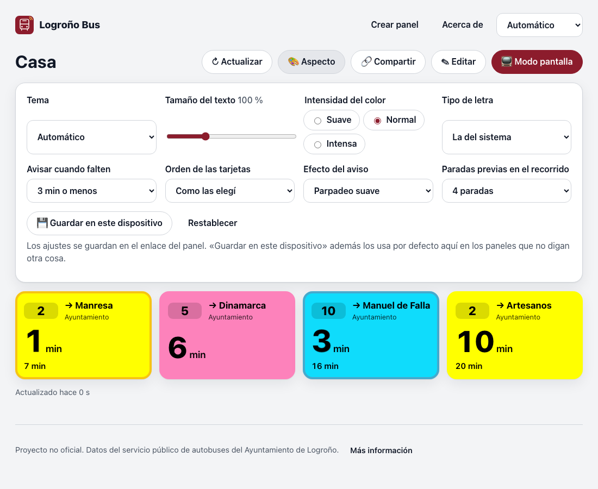{ width="640" }

## Dónde se guarda

- **En el enlace del panel.** Así, el mismo enlace se ve igual en el móvil, en el Echo Show o en
  el Portal. Si lo tenías abierto en otra pantalla, vuelve a abrirlo con el enlace nuevo
  (**🔗 Compartir** te lo da, también como QR).
- **💾 Guardar en este dispositivo** (opcional) hace que esos ajustes sean los de **este**
  navegador para cualquier panel que no diga otra cosa. Útil, por ejemplo, para que todo se vea con
  letra grande en la tablet de la cocina.

## Temas

| Tema | Para qué |
|---|---|
| **Automático** | Claro de día y oscuro de noche, según el sistema. |
| **Claro** / **Oscuro** | Siempre igual. |
| **Alto contraste** | Fondo negro, letras blancas, color de la línea en una franja. Para ver de lejos o con poca vista. |
| **Logroño** | Tonos crema y vino de Rioja. |
| **Tinta** | Blanco y negro, sin animaciones: parecido a un libro electrónico. |

=== "Automático"
    { width="480" }
=== "Oscuro"
    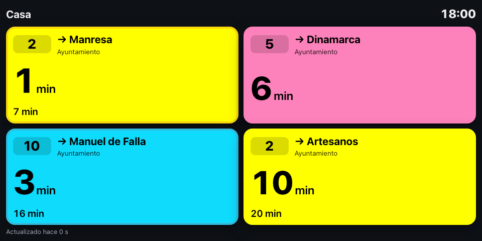{ width="480" }
=== "Alto contraste"
    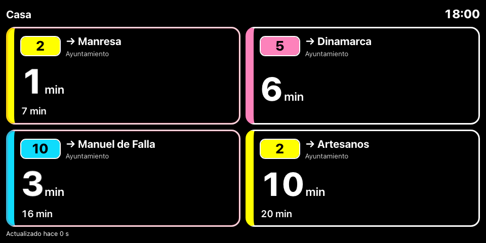{ width="480" }
=== "Logroño"
    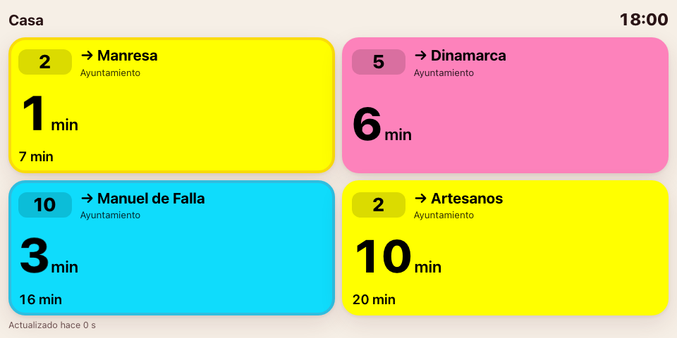{ width="480" }
=== "Tinta"
    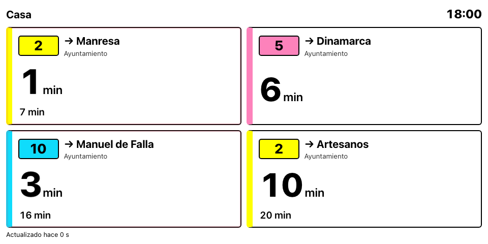{ width="480" }

## Tamaño del texto

De **80 %** a **150 %**. En el modo pantalla el texto ya se ajusta solo al tamaño de cada tarjeta;
este ajuste lo hace más grande (o más pequeño) a partir de ahí.

## Intensidad del color

- **Suave**: el color de la línea, rebajado. Descansa más la vista, sobre todo de noche.
- **Normal**: el color oficial de la línea.
- **Intensa**: colores más saturados, para pantallas que se ven apagadas.

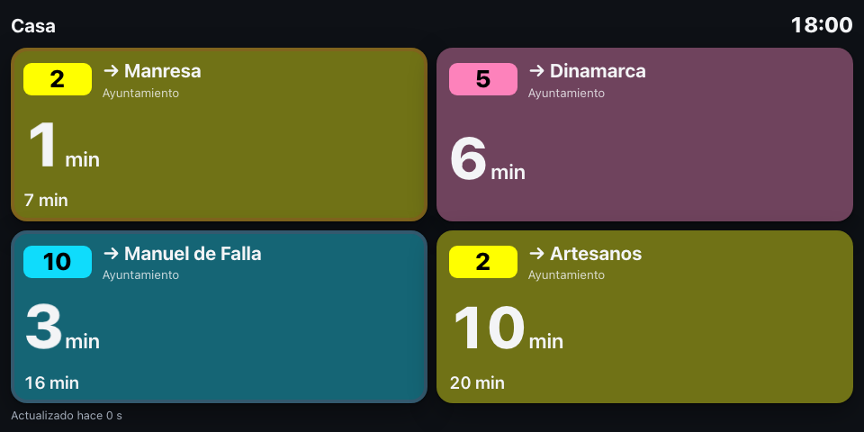{ width="480" }

## Tipo de letra

- **La del sistema**: la del dispositivo.
- **Muy legible**: [Atkinson Hyperlegible](https://www.brailleinstitute.org/freefont/), diseñada
  para personas con baja visión: cada número y letra se distingue bien de los demás.
- **Redondeada**: si el dispositivo la tiene (si no, usa la del sistema).
- **Tipo panel**: monoespaciada, como los paneles de las paradas.

## Orden de las tarjetas

- **Como las elegí** (por defecto): el orden en que añadiste paradas y líneas.
- **Por número de línea**: 1, 2, 5, 10… y después las B1, B2, B3.
- **El que llega antes, primero**: la tarjeta del próximo autobús arriba (o a la izquierda en el
  modo pantalla). Las que no tienen ningún autobús previsto van al final.

Con «el que llega antes», cuando un autobús adelanta a otro la tarjeta **se desliza** a su nuevo
sitio y la que sube se agranda un instante, para que veas qué ha cambiado sin buscarlo. Con
«reducir movimiento» activado, o con el tema **Tinta**, simplemente cambia de sitio.

## Recorrido

Al tocar una tarjeta se abre el [recorrido](index.md#donde-esta-mi-autobus). En **Paradas previas
en el recorrido** eliges cuántas paradas antes de la tuya quieres ver (de 1 a 12; por defecto 4).
Con pocas paradas todo se ve más grande; con más, ves de más lejos qué autobuses vienen. Si la
pantalla no tiene sitio para todas, se muestran las que caben.

## Avisos

Cuando al próximo autobús de una tarjeta le falten **N minutos o menos**, la tarjeta se resalta
para que la veas de un vistazo y salgas a tiempo.

- **Avisar cuando falten**: de 1 a 15 minutos, o **No avisar**. Por defecto, **3 minutos**.
- **Efecto**: cómo se resalta la tarjeta. Todos se ven sobre cualquier color de línea, también
  sobre las rojas:
    - **Parpadeo suave** (por defecto): un doble borde, negro y blanco, que parpadea, y el número
      late un poco.
    - **Borde fijo**: el mismo doble borde, quieto.
    - **Destello**: la tarjeta entera alterna con sus colores invertidos. Es lo que más se ve
      desde lejos.
    - **Etiqueta «¡Ya llega!»**: un aviso escrito junto a los minutos, sin nada que se mueva.
    - **Rayas de aviso**: un marco de rayas amarillas y negras, como una señal de obras.
    - **Sin efecto**.

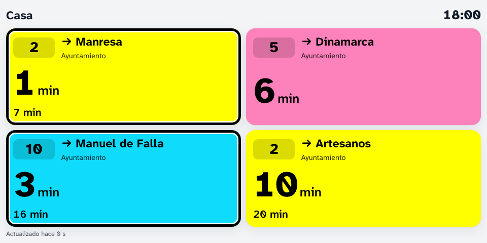{ width="480" }

=== "Borde fijo"
    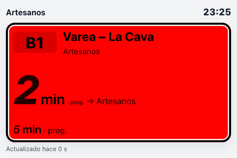{ width="360" }
=== "Destello"
    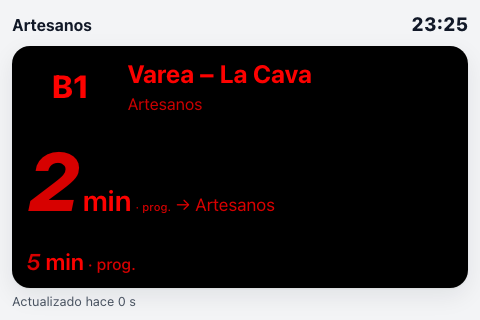{ width="360" }
=== "Etiqueta"
    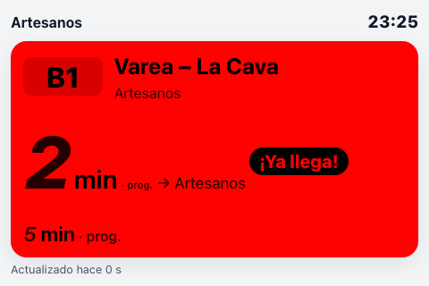{ width="360" }
=== "Rayas"
    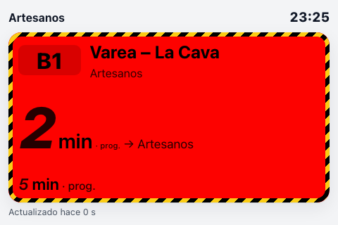{ width="360" }

!!! tip "Si el parpadeo molesta"
    Si tu dispositivo tiene activado **«reducir movimiento»** (accesibilidad), nada parpadea: el
    parpadeo suave se queda en borde fijo y el destello, con los colores invertidos. El tema
    **Tinta** tampoco anima nada. Si prefieres un aviso sin movimiento, elige **Etiqueta** o
    **Rayas**.

??? info "Parámetros del enlace"
    | Ajuste | Parámetro | Valores |
    |---|---|---|
    | Tema | `tema` | `auto`, `claro`, `oscuro`, `alto-contraste`, `logrono`, `tinta` |
    | Modo | `modo` | `panel`, `kiosko` (pantalla) |
    | Llegadas por tarjeta | `n` | `1`–`4` |
    | Título | `titulo` | texto |
    | Tamaño | `tam` | `80`–`150` |
    | Color | `color` | `suave`, `normal`, `intensa` |
    | Letra | `letra` | `sistema`, `legible`, `redondeada`, `mono` |
    | Aviso | `aviso` | minutos `0`–`15` (`0` = no avisar) |
    | Efecto | `efecto` | `pulso`, `borde`, `destello`, `etiqueta`, `rayas`, `ninguno` |
    | Orden | `orden` | `seleccion`, `linea`, `llegada` |
    | Paradas previas en el recorrido | `previas` | `1`–`12` (por defecto `4`) |
    | Origen de datos | `origen` | `auto`, `directa`, `servidor` |
    | Servidor propio | `api` | URL, p. ej. `https://bus.casa.example/api/v1` |
