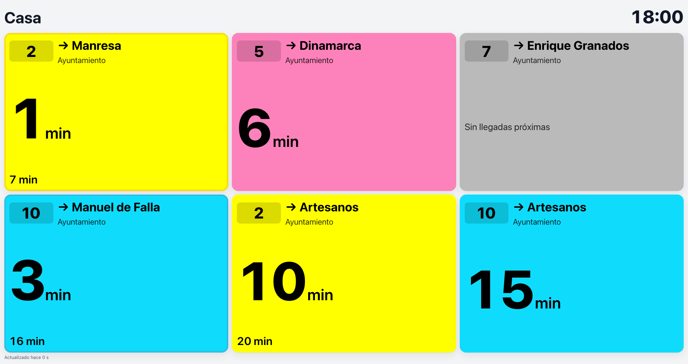
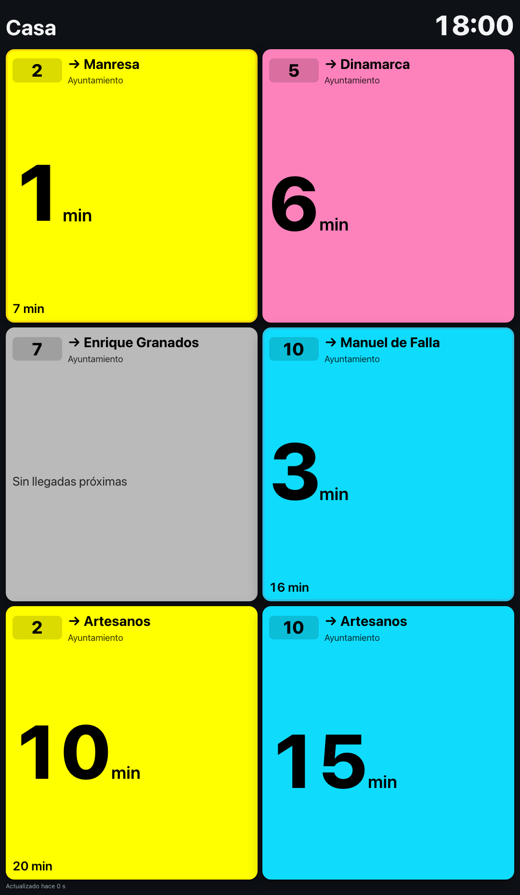
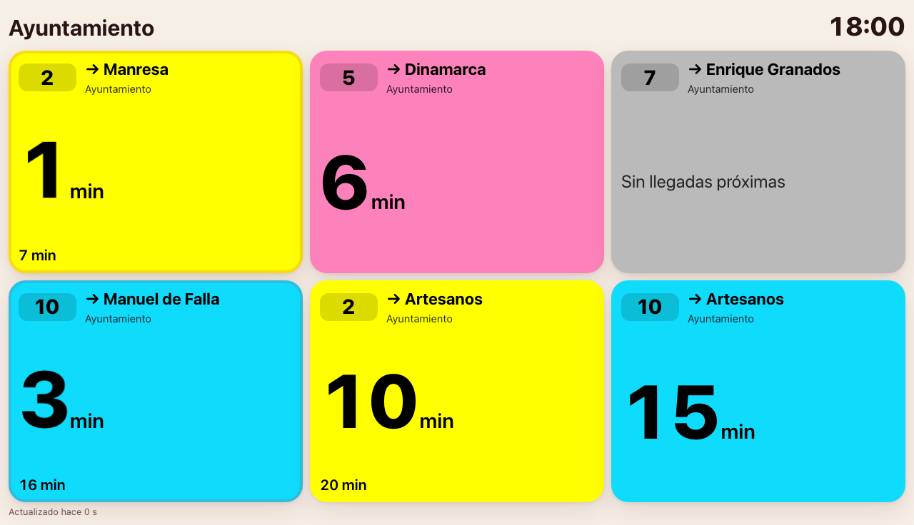

# Meta Portal

Los **Meta (Facebook) Portal** son buenas pantallas para tener el panel siempre a la vista. El
modo pantalla se ha probado con sus resoluciones, en horizontal y en vertical:

| Modelo | Pantalla | Orientación |
|---|---|---|
| Portal Mini (8") | 1280×800 | Horizontal y vertical |
| Portal (10", 2019) | 1280×800 | Horizontal y vertical |
| Portal Go (10") | 1280×800 | Horizontal |
| Portal+ (15,6", 2018) | 1920×1080 | **Gira**: horizontal y vertical |
| Portal+ (14", 2021) | 2160×1440 | Horizontal |

=== "Portal+ horizontal"
    { width="640" }
=== "Portal+ vertical"
    { width="300" }
=== "Portal 8″/10″"
    { width="560" }

Las tarjetas se recolocan solas al girar el Portal+ (tres columnas en horizontal, dos en
vertical) sin recargar la página.

## Abrirlo con el navegador del Portal

1. Prepara el enlace en modo pantalla como en el [paso 1 del Echo Show](05-echo-show.md#paso-1-prepara-el-enlace).
2. En el Portal, abre **Aplicaciones → Navegador**.
3. Escribe el enlace y ábrelo.
4. Usa la opción de **fijar el sitio en la pantalla de inicio** (pestaña *Sitios web* en
   *Aplicaciones*): así lo abres con un toque.

!!! warning "El Portal ya no recibe novedades"
    Meta dejó de vender los Portal en 2022 y desde entonces ha ido retirando funciones: el
    asistente de voz **«Hey Portal» dejó de funcionar en enero de 2025**, así que **no se puede
    abrir el panel por voz**. El navegador seguía funcionando en 2026. Como el sistema es antiguo,
    no conviene usarlo para nada más que mostrar información.

## Dejarlo fijo en pantalla (avanzado)

El navegador del Portal vuelve a la pantalla de inicio tras un rato sin uso. Para un panel
permanente, la comunidad usa la **depuración por ADB**, que Meta documenta oficialmente
(*Ajustes → Depuración → ADB*), para instalar un lanzador o una aplicación de tipo «kiosko» que
abra una web a pantalla completa:

- [Immortal](https://github.com/starbrightlab/immortal): lanzador alternativo con salvapantallas web.
- [portal-ha-bridge](https://github.com/RoadRunner-1024/portal-ha-bridge): integra el Portal en
  Home Assistant y puede mostrar un panel a pantalla completa.

Estos proyectos no son nuestros: lee sus instrucciones y avisos antes de usarlos. Meta advierte de
que instalar aplicaciones externas puede poner en riesgo la cuenta y el dispositivo.

!!! tip "¿Se ve raro en tu Portal?"
    Abre la web, ve a **Acerca de → Datos de esta pantalla** y copia lo que aparece al avisar del
    problema. Con eso podemos reproducirlo.
