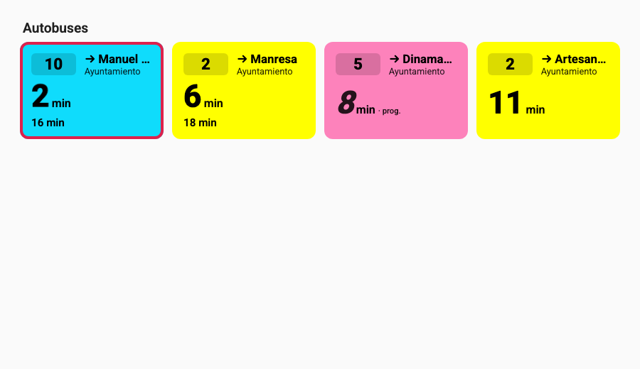
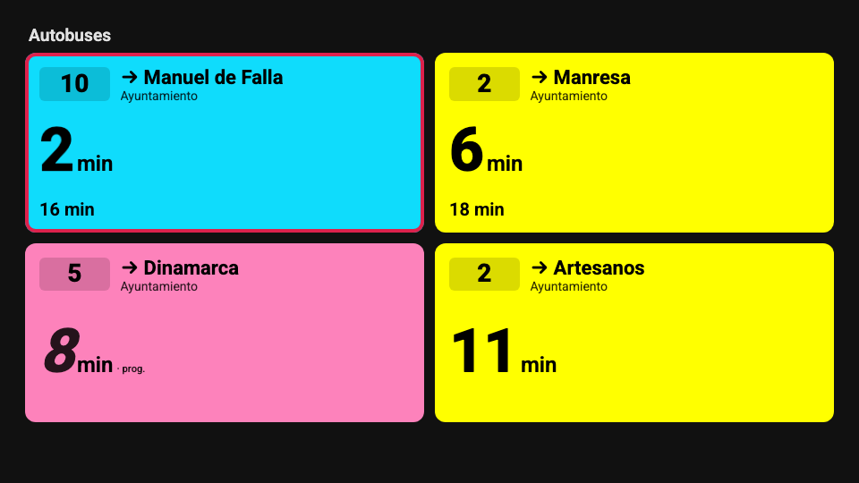

# Home Assistant

La integración **Logroño Bus** para Home Assistant crea un sensor por cada línea y sentido de las
paradas que elijas. Con ellos puedes hacer tarjetas en tus paneles, automatizaciones («avísame
cuando falten 5 minutos para el 2») y [widgets en Android](08-widgets-android.md).

No necesita el servidor Docker: habla directamente con el servicio del Ayuntamiento.

## Instalar con HACS

[HACS](https://hacs.xyz/) es la tienda de integraciones de la comunidad. Si no lo tienes, sigue
[su guía de instalación](https://hacs.xyz/docs/use/) primero.

1. Pulsa este botón (te lleva a tu Home Assistant):

    [](https://my.home-assistant.io/redirect/hacs_repository/?owner=chiva&repository=ha-logrono-bus&category=integration)

    O a mano: **HACS → ⋮ → Repositorios personalizados**, añade
    `https://github.com/chiva/ha-logrono-bus` con tipo **Integración**.
2. Busca **Logroño Bus** en HACS y pulsa **Descargar**.
3. **Reinicia Home Assistant** (*Ajustes → Sistema → Reiniciar*).

## Añadir la integración y tus paradas

1. *Ajustes → Dispositivos y servicios → Añadir integración* → **Logroño Bus**.
2. Pulsa **Enviar**: no hay nada que configurar todavía.
3. En la tarjeta de Logroño Bus, pulsa **Añadir parada**.
4. Escribe el nombre o número de la parada. Si tu casa tiene ubicación configurada, verás primero
   las más cercanas. Cada opción dice hacia dónde van sus autobuses, para distinguir paradas con el
   mismo nombre.
5. Marca las líneas y sentidos que te interesen (por ejemplo **2 → Manresa**) y pulsa **Enviar**.

Repite **Añadir parada** para cada parada. Para cambiar las líneas de una parada, pulsa ⋮ junto a
ella → **Reconfigurar**.

**Cómo saber que ha funcionado:** aparece un dispositivo por parada (por ejemplo
«Ayuntamiento (101)») con dos sensores por línea:

| Sensor | Ejemplo de estado | Para qué |
|---|---|---|
| `sensor.ayuntamiento_101_2_manresa_proxima_llegada` | `2026-10-03T18:04:30+02:00` | Hora exacta; Home Assistant la muestra como «en 4 minutos». |
| `sensor.ayuntamiento_101_2_manresa_minutos` | `4` | Minutos que faltan, para automatizaciones. En widgets usa mejor la hora (ver [widgets](08-widgets-android.md)). |

Atributos de los sensores: `siguientes` (minutos de los siguientes autobuses), `tiempo_real`,
`retraso_s`, `destino`, `color` y `color_texto` (colores oficiales de la línea).

Y del horario de hoy de la línea en ese sentido (horas de **salida desde la primera parada**, no
de paso por la tuya):

| Atributo | Ejemplo | Qué es |
|---|---|---|
| `servicio` | `en_servicio` | `antes` (aún no ha empezado), `en_servicio`, `terminado` o `sin_servicio` (hoy no circula). |
| `primera_salida` / `ultima_salida` | `07:15` / `22:45` | Primera y última salida de hoy. |
| `proxima_salida` | `18:30` | Próxima salida desde la cabecera. |
| `frecuencia_min` / `frecuencia_max_min` | `30` / `30` | Cada cuántos minutos sale ahora (dos valores si varía). |
| `salidas_desde` | `Artesanos` | Parada desde la que salen. |

Con `servicio` puedes, por ejemplo, no recibir avisos cuando la línea ya ha terminado, o mostrar
«último autobús a las 22:45» en una tarjeta.

## La tarjeta Logroño Bus

La integración trae su propia **tarjeta para los paneles**, con el mismo aspecto que la web: color
de cada línea, minutos grandes, aviso cuando el autobús está cerca y, al tocar, el recorrido con
los autobuses en marcha. No hay que instalar nada más: se carga sola con la integración.

{ width="640" }

1. Edita un panel → **Añadir tarjeta** → busca **Logroño Bus**.
2. En **Líneas**, elige los sensores «… minutos» que quieras ver (puedes mezclar paradas).
3. Ajusta el resto si quieres y **Guardar**.

| Opción | Qué hace | Por defecto |
|---|---|---|
| Título | Encabezado de la tarjeta | (ninguno) |
| Orden de las tarjetas | Como las elegí · por número de línea · el que llega antes | Como las elegí |
| Modo | **Pantalla** llena toda la vista: para Echo Show, tablets o un panel de pared | Normal |
| Avisar cuando falten | Resalta la línea cuando el autobús está a N minutos (0 = no) | 3 |
| Efecto del aviso | Parpadeo suave · borde fijo · sin efecto | Parpadeo suave |
| Intensidad del color | Suave · normal · intensa | Normal |
| Tipo de letra | La del sistema · muy legible · redondeada · tipo panel | La del sistema |
| Tamaño del texto | 80–150 % | 100 % |
| Ver el recorrido | Al tocar, ver por dónde van los autobuses | Sí |
| Paradas previas en el recorrido (`previas`) | Cuántas paradas antes de la tuya se ven (1–12) | 4 |

Los colores de fondo y de texto siguen el **tema de Home Assistant**.

=== "YAML"
    ```yaml
    type: custom:logrono-bus-card
    titulo: Casa
    entities:
      - sensor.ayuntamiento_101_2_manresa_minutos
      - sensor.ayuntamiento_101_10_manuel_de_falla_minutos
    orden: llegada
    aviso: 3
    efecto: pulso
    modo: pantalla
    ```
=== "Modo pantalla (tema oscuro)"
    { width="640" }

!!! tip "Una vista solo para la tarjeta"
    Para un Echo Show o una tablet, crea una vista de tipo **Panel (una sola tarjeta)** con la
    tarjeta en modo **pantalla**: ocupará toda la pantalla, como el modo pantalla de la web.

!!! info "El recorrido consulta al Ayuntamiento"
    Las posiciones de los autobuses no son sensores de Home Assistant: al abrir el recorrido, el
    navegador las pide directamente al servicio público del Ayuntamiento, solo mientras está abierto.

## Aviso en el móvil cuando llega el autobús

La forma más sencilla es el **blueprint** (una automatización ya hecha que solo hay que rellenar):

1. Pulsa el botón para importarlo en tu Home Assistant:

    [](https://my.home-assistant.io/redirect/blueprint_import/?blueprint_url=https%3A%2F%2Fgithub.com%2Fchiva%2Fha-logrono-bus%2Fblob%2Fmain%2Fblueprints%2Fautomation%2Flogrono_bus%2Faviso_llegada.yaml)

    (o en **Ajustes → Automatizaciones y escenas → Blueprints → Importar blueprint**, pega
    `https://github.com/chiva/ha-logrono-bus/blob/main/blueprints/automation/logrono_bus/aviso_llegada.yaml`).

2. Pulsa **Crear automatización** en el blueprint «Logroño Bus · Avisar cuando llega el autobús».
3. Elige la **línea** (su sensor «… minutos»), con cuánta antelación (por defecto, menos de 6
   minutos) y **dónde avisar**: tu móvil, que necesita la aplicación oficial de Home Assistant.
4. En **Cuándo avisar** puedes cambiar el horario (de 07:00 a 22:00 por defecto) y los días.

Te llegará algo así:

> **🚌 2 → Manresa**
> Llega a Ayuntamiento en 5 min. El siguiente, en 14 min.

- Solo avisa con el autobús **localizado** (en tiempo real), salvo que lo cambies.
- Después de avisar espera **10 minutos** antes de volver a hacerlo, para que un tiempo que sube y
  baja (5, 6, 5…) no te mande varios avisos del mismo autobús.
- En **Además** puedes añadir otras acciones, como anunciarlo en un altavoz; el texto del aviso
  está en `{{ mensaje }}`.
- ¿Varias líneas? Crea una automatización por línea desde el mismo blueprint.

## Opciones

En la integración → **Configurar**:

- **Cada cuánto actualizar**: de 30 a 300 segundos (60 por defecto). No hace falta menos: el
  servicio del Ayuntamiento es público y conviene no cargarlo.

## Ejemplos

=== "Tarjeta"
    ```yaml
    type: entities
    title: Autobuses
    entities:
      - entity: sensor.ayuntamiento_101_2_manresa_minutos
        name: "2 → Manresa"
      - entity: sensor.ayuntamiento_101_10_manuel_de_falla_minutos
        name: "10 → Manuel de Falla"
    ```

=== "Automatización a mano"
    Si prefieres no usar el [blueprint](#aviso-en-el-movil-cuando-llega-el-autobus):
    ```yaml
    alias: Aviso del autobús 2
    triggers:
      - trigger: numeric_state
        entity_id: sensor.ayuntamiento_101_2_manresa_minutos
        below: 6
    conditions:
      - condition: time
        after: "07:30:00"
        before: "08:30:00"
        weekday: [mon, tue, wed, thu, fri]
    actions:
      - action: notify.send_message
        target:
          entity_id: notify.tu_movil
        data:
          message: "El 2 llega en {{ states('sensor.ayuntamiento_101_2_manresa_minutos') }} min"
    ```

=== "El panel web dentro de Home Assistant"
    Puedes mostrar el panel web tal cual en un panel de Home Assistant (por ejemplo, en una tablet
    o en el Echo Show) con una tarjeta **Página web**:
    ```yaml
    type: iframe
    url: https://chiva.github.io/logrono-bus/?v=1&p=101-2d.10d&modo=kiosko
    aspect_ratio: 50%
    ```

## Si algo falla

- **«No se puede contactar con el servicio»**: el servicio del Ayuntamiento no responde; la
  integración reintenta sola.
- **Aviso en *Reparaciones* «El servicio de autobuses ha cambiado»**: el Ayuntamiento ha cambiado
  su servicio y hay que actualizar la integración. Mira si hay versión nueva en HACS.
- **Aviso «La parada … ya no existe»**: tras un cambio de líneas, una parada que elegiste ha
  desaparecido. Elimínala en la integración y añade la nueva con *Añadir parada*; el aviso se va
  solo.
- **Aviso «Algunas líneas ya no pasan por la parada …»**: una línea (o un sentido) que seguías ya
  no para ahí, y sus sensores se quedan sin datos. Usa *Reconfigurar* en esa parada y elige las
  líneas actuales; el aviso se va solo.
- Para pedir ayuda, descarga los **diagnósticos** (⋮ en la integración → *Descargar
  diagnósticos*) y adjúntalos en GitHub.
