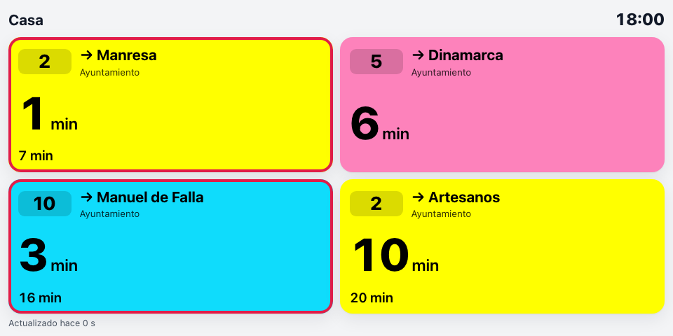
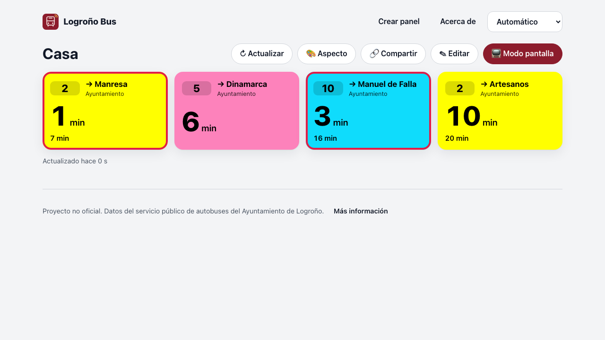
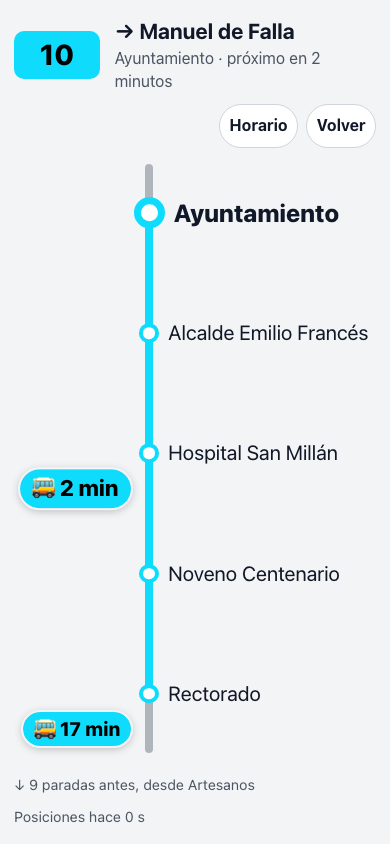
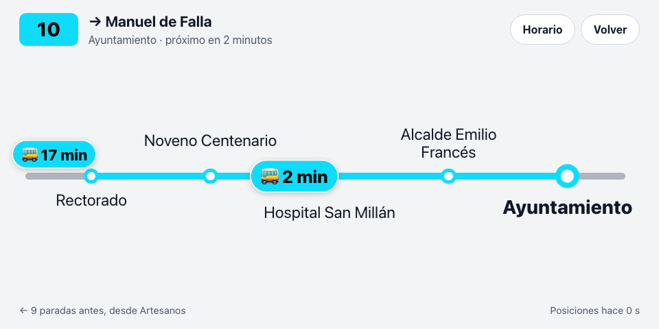
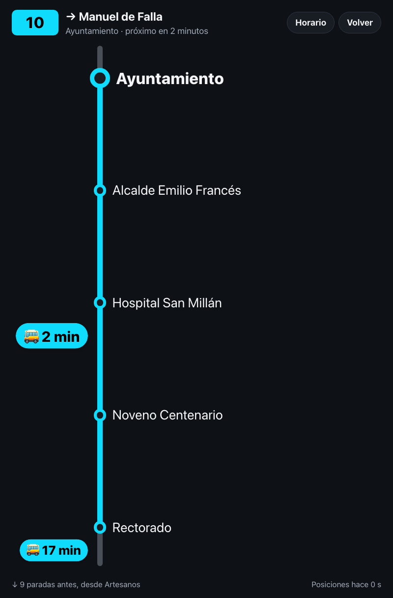
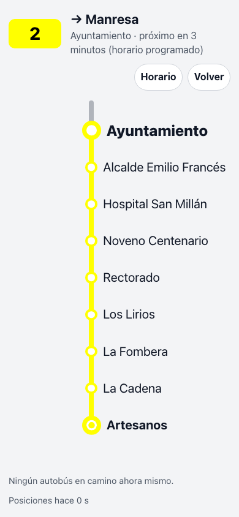
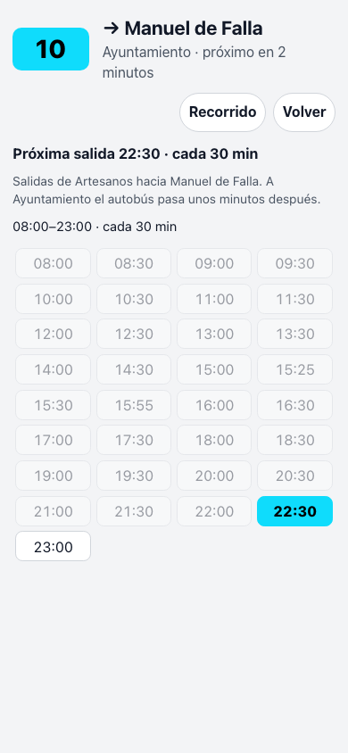
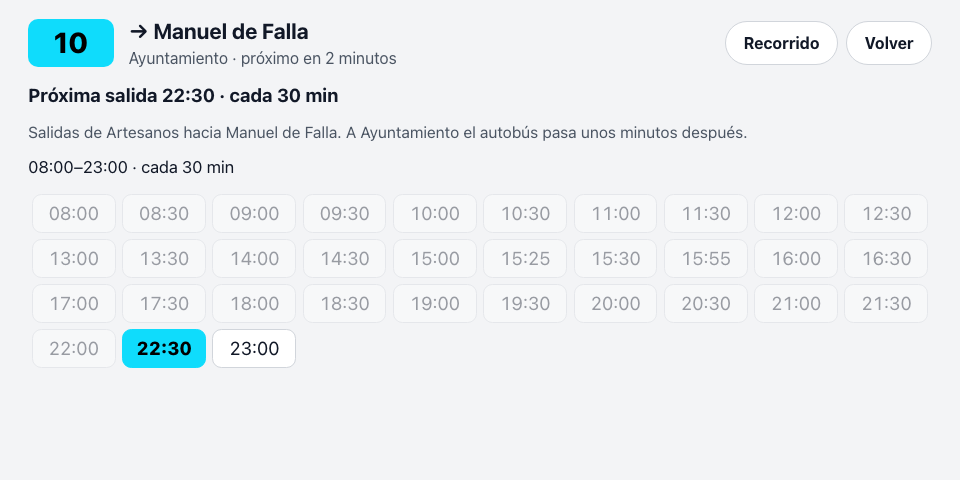

# Logroño Bus

**¿Cuánto le falta a tu autobús?** Logroño Bus te enseña, en tiempo real, cuántos minutos faltan
para que pasen los autobuses urbanos de Logroño por las paradas que tú elijas.

{ width="480" }

Puedes tenerlo:

- **En el móvil**, como si fuera una aplicación más → [Usarlo en el móvil](02-usar-en-el-movil.md)
- **En una pantalla de casa** (Echo Show, Meta Portal, una tablet vieja…) → [Echo Show](05-echo-show.md) · [Portal](06-portal.md)
- **En Home Assistant**, con un sensor por línea → [Home Assistant](07-home-assistant.md)
- **En un widget de Android** → [Widgets en Android](08-widgets-android.md)

No hay que instalar nada ni registrarse: entra en
**[chiva.github.io/logrono-bus](https://chiva.github.io/logrono-bus/)** y crea tu panel.

!!! info "Proyecto no oficial"
    Logroño Bus **no es del Ayuntamiento de Logroño** ni de la empresa de autobuses. Usa los mismos
    datos públicos que la web oficial ([transporteurbano.logrono.es](https://transporteurbano.logrono.es/)).
    Si algo no cuadra, la fuente de verdad es esa. Más en [Privacidad y aviso legal](13-privacidad.md).

## Cómo leer una tarjeta

{ width="640" }

Cada tarjeta es **una línea, en un sentido, en una parada**, pintada con el color oficial de la
línea:

| Lo que ves | Qué significa |
|---|---|
| **2** (recuadro) | Número de la línea, como en el cartel del autobús. |
| **→ Manresa** | Hacia dónde va: la última parada del recorrido. |
| *Ayuntamiento* | La parada. |
| **4 min** (grande) | Lo que falta para el próximo autobús. |
| 12 min · 25 min | Los siguientes. |
| **Llegando** | Falta menos de un minuto. |
| **18:42** | Si falta más de una hora, se muestra la hora. |
| *prog.* (cursiva) | No hay un autobús localizado: es la hora del horario. |
| ~~Cancelado~~ | Ese autobús no va a pasar. |
| Borde rojo o parpadeo | Llega en pocos minutos ([se puede ajustar](04-aspecto.md#avisos)). |

## ¿Dónde está mi autobús?

**Toca una tarjeta** (con el dedo o con el ratón) y verás el recorrido de esa línea hasta tu
parada: tu parada arriba (o a la derecha, en pantallas apaisadas), las anteriores debajo, y **cada
autobús donde está ahora mismo**, con los minutos que le faltan. Se actualiza sola cada 15 segundos
y se cierra sola al cabo de 15 minutos sin tocarla (o con **Volver**).

- Se ven **4 paradas antes de la tuya**; puedes poner entre 1 y 12 en
  [el aspecto](04-aspecto.md#recorrido). Si la pantalla no tiene sitio, se muestran menos.
- El **tramo gris** indica que la línea sigue: antes de la primera parada que ves y, si tu parada
  no es la última, después de ella.
- Si se ve **el principio o el final de la línea**, esa parada lleva un círculo grande relleno y
  su nombre en negrita, como en los planos de metro. Tu parada lleva el círculo grande hueco, o
  relleno si la línea acaba en ella.
- Un autobús que viene **más lejos** que las paradas que ves espera sobre el tramo gris del
  principio, con sus minutos; «+1» quiere decir que hay otro más detrás.
- Si la posición que llega pone un autobús **un poco más atrás** (hasta una parada, pasa en calles
  con curvas), se queda donde estaba hasta que vuelva a avanzar. Si lo pone más atrás todavía, se
  entiende que la posición anterior era errónea y se corrige.

=== "Móvil"
    { width="300" }
=== "Echo Show"
    { width="480" }
=== "Portal en vertical"
    { width="300" }
=== "Con el principio de la línea"
    { width="300" }

!!! note "Cómo se sabe cuál es «tu» autobús"
    El servicio del Ayuntamiento da la posición de cada autobús, pero no cuál es cuál en la lista
    de llegadas. Se deduce por el orden: el más cercano a tu parada es el próximo en llegar.
    Casi siempre coincide; si un autobús se queda parado o sale de cocheras, puede bailar un poco.

## Horario de la línea

En la vista del recorrido, el botón **Horario** muestra las salidas de hoy de esa línea en tu
sentido: la próxima resaltada, las que ya han salido en gris y la frecuencia por franjas («cada
30 min»). **Recorrido** vuelve al mapa de paradas.

=== "Móvil"
    { width="300" }
=== "Echo Show"
    { width="480" }

!!! note "Son horas de salida, no de paso por tu parada"
    El Ayuntamiento publica a qué hora sale cada autobús de la **primera parada** de la línea. A
    tu parada llega unos minutos después, según dónde estés en el recorrido. Para saber cuándo
    llega a la tuya, mira la tarjeta: esos minutos sí son de tu parada.

Cuando una tarjeta no tiene ningún autobús próximo, dice por qué:

| La tarjeta dice | Qué significa |
|---|---|
| Primera salida a las 07:15 | Aún no ha empezado el servicio de hoy. |
| Servicio terminado · última salida 22:45 | Ya ha salido el último autobús de hoy. |
| Hoy no hay servicio | La línea no circula hoy en ese sentido. |
| Sin llegadas próximas · pasa cada 30 min | Está en servicio, pero ahora no viene ninguno pronto. |

Al tocar una tarjeta así se abre directamente el horario.

## ¿Por dónde empiezo?

1. [Crea tu panel](03-crear-tu-panel.md) en dos minutos.
2. Elige [el aspecto](04-aspecto.md): tema, tamaño de letra, avisos.
3. Llévalo a la pantalla donde lo vayas a mirar.
